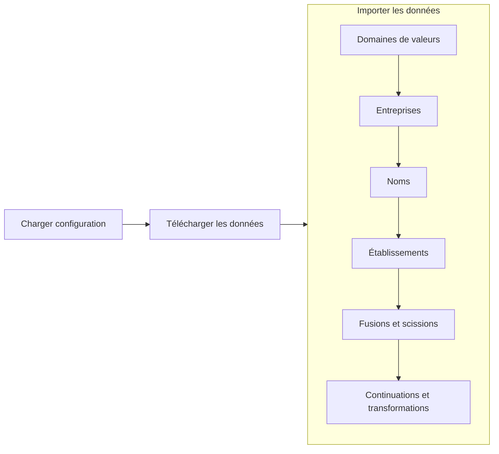

# Outils REQ

## Synchroniser les données ouvertes

Les données ouvertes sont un export des données publiques du REQ. Elles sont fournies au format CSV et contiennent des millions d'enregistrements.

Ce module permet de les télécharger automatiquement sur internet et de les charger dans une base de données Postgres.

Il a été testé sur linux et mac, mais pas sur Windows.

### Pré-requis #1: Avoir une base de données Postgres à sa disposition

Si vous voulez éviter de faire cette configuration manuellement, il y a un fichier docker compose dans le répertoire docker qui s'utilise comme suit : 

```bash
    cd {chemin_du_repertoire_docker}
    docker compose up -d
```

Par la suite, vous devez exécuter le script creer_bd.sql pour créer la base de données. Vous pouvez éditer le script au préalable pour changer les mots de passes des comptes.

```bash
    cd {chemin_du_repertoire_sql}
    docker cp creer_bd.sql postgres:/
    docker exec -u postgres -it postgres /bin/bash
    psql -f creer_bd.sql
```

### Pré-requis #2 : Avoir un environnement python avec les librairies nécessaires

Le module a été testé avec la version 3.11.3 de python. Exécutez la commande suivante pour installer ses dépendances :

```bash
    pip install -r dependances.txt
```

### Pré-requis #3 : Avoir firefox d'installé

Il faut pouvoir exécuter du javascript pour consulter la page des données ouvertes et télécharger le jeu de données. Pour se faire, on utilise firefox via selenium.

### Utilisation

Commencez par initialiser le fichier de configuration de l'outil comme suit : 

```bash
    cd {repertoire_src}
    python -m synchroniser_donnees_ouvertes creer_configuration
```

Selon votre système d'exploitation, le fichier sera créé à un endroit différent (Attention, pas testé sur Windows) :

| OS          | Chemin                                                               |
|-------------|----------------------------------------------------------------------|
|Linux / Mac  |~/.config/outils-req/synchroniser-donnees-ouvertes/config.json
|Windows      |~/AppData/Roaming/outils-req/synchroniser-donnees-ouvertes/config.json|

C'est le moment d'éditer le fichier de configuration pour changer le répertoire de stockage des données ouvertes ou les paramètres de Postgres.

Ensuite, lancez :

```bash
    python -m synchroniser_donnees_ouvertes
```

Le flux du programme sera le suivant :



Chaque étape peut être lancée individuellement :

| Étape                              | Arguments (après "python -m synchroniser_donnees_ouvertes")|
|------------------------------------|------------------------------------------------------------|
|Charger configuration               |creer_configuration                                         |
|Télécharger données                 |telecharger                                                 |
|Importer domaines de valeurs        |importer domaine_valeur                                     |
|Importer entreprises                |importer entreprise                                         |
|Importer noms                       |importer nom                                                |
|Importer établissements             |importer etablissement                                      |
|Importer fusion/scission            |importer fusion_scission                                    |
|Importer continuation/transformation|importer continuation_transformation                 |
